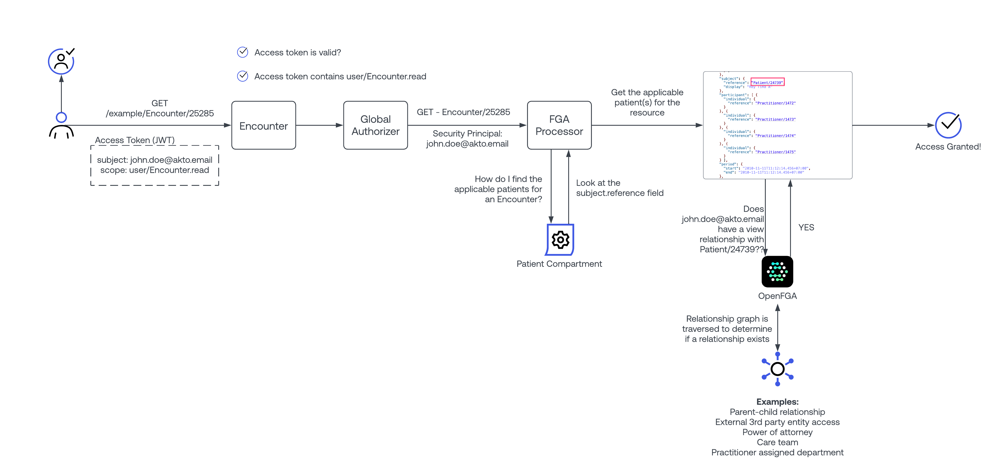

# smart-authorized-fhir-proxy
A reference implementation of a multi-tenant, secured FHIR API.

## Overview
The goal of this repository is to create a "multi-tenant" FHIR proxy that enables the ability to quickly and efficiently research new and varied healthcare interoperability security standards such as UDAP, SMART launch framework, and the FAST Identity implementation guide. This proxy will sit in front of an existing, non-secured FHIR service. You may provide this FHIR service yourself, or https://hapi.fhir.org is also an excellent, publicly available resource.

***Note- this proxy currently only supports read/search/$match operations.***

Each "tenant" in this proxy can be configured to support different security features such as:
* Support for a completely seperate authorization server per tenant
* Ability to support SMART v1 and SMART v2 authorization models
* Ability to optionally support [UDAP](https://build.fhir.org/ig/HL7/fhir-udap-security-ig/)
* Ability to optionally support [Fine grained access control](https://fga.dev)

## Authorization Processing
Another primary goal of this repository is to serve as a reference implementation for properly securing FHIR resources using OAuth2 access tokens. It proposes both coarse grained as well as fine grained access control strategies.  

### Authorization Strategy Overview
The following block diagram outlines the strategy that every FHIR request goes through:

**Global Authorizer:** 

This component will do basic access token validation checks to ensure a valid access token has been provided by the client. This module runs regardless of access control model selected.

**Scope Processor:** 

This component will do basic matching of requested resource and scopes granted to the access token. For example, if Patient/123 is requested, the token must include a <user|system|patient>/Patient.<read|r|*> scope. This module runs regardless of access control model selected.

**CGA Processor (Coarse Grained Access Processor):**

This processor runs under 2 conditions:
1. Tenant configuration defines the use of CGA vs. FGA.
2. If a patient/* scope is granted to the access token.  

CGA is always used to process patient/* tokens because these tokens are, by definition, only scoped to ONE patient, and therefore additional FGA processing doesn't apply.

For system/* tokens, no additional authorization checks are performed. Full read access to all records is allowed.

For user/* scopes, the CGA processor uses relatively basic logic to determine if a security principal is allowed to access a given resource. It uses well known FHIR "compartment" principals to determine access.

The processor takes in an inbound FHIR security principal, as well as the FHIR object being requested. The FHIR security principal will be a Patient|Practitioner|RelatedPerson, and the FHIR object will be any FHIR object.

To allow access, the processor will first pull the relevant compartment for the inbound security principal, and it will use that compartment to determine which attributes to inspect to find a reference to the inbound security principal.  If the inbound security principal is found in any of the referenced attributes, access is granted.

Example:
A Practitioner with ID 1234 is using an application, and they attempt to view an Encounter with ID 4567.
In this scenario, the Security principal is Practitioner/1234, and the FHIR Object is Encounter/4567

Steps taken:
1. Load up a cache of the practitioner compartment
2. Look up the applicable attributes for the "encounter" object.
3. It is discovered that, according to the compartment, that a practitioner may be referenced in the following fields on the encounter: Encounter.participant.actor.reference, OR Encounter.participant.actor.reference
4. Both fields are checked on the requested record (encounter 4567 in this case), and if either field is equal to "Practitioner/1234", then access is granted.

**FGA Processor (Fine Grained Access Processor):**
This processor runs under 2 conditions:
1. Tenant configuration defines the use of FGA- AND
2. If a user/* or system/* scope is granted.

The FGA processor works in a similar fashion to the CGA processor. When a security principal requests access to a FHIR object, the patient compartment definition is used to compile a list of "applicable patients" that the FHIR object is related to.  Once a list of applicable patients is compiled, each one, along with the security principal- is sent to Okta FGA to check for access.  How this access is granted is not our concern, but rather the concern of the FGA system. This logic has the benefit of being simpler than the GGA processor, due to externalization of complexity to the FGA platform.

Another aspect to understand here is that, with the FGA model- the security principal does not need to be a FHIR resource! This opens the door for new use cases such as 3rd party access for trust community member, removes the need for RelatedPerson records for authorized representatives, and other such similar use cases.

Example:
A Practitioner with ID 1234 is using an application, and they attempt to view an Encounter with ID 4567. Encounter 4567 is associated with Patient/8901.
In this scenario, the Security principal is Practitioner/1234, and the FHIR Object is Encounter/4567

Steps taken:
1. Load up a cache of the patient compartment
2. Look up the applicable attributes for the "encounter" object.
3. It is discovered that, according to the compartment, that a patient may be referenced in the following fields on the encounter: Encounter.subject.reference
4. If found, the value for Encounter.subject.reference is retrieved (Patient/8901), and an FGA check is performed to determine if Practitioner/1234 has a "can_view" relationship with Patient/8901. Access is granted if the FGA system responds with an affirmative result.

It should be noted that the FGA processor also works in system/* mode- enabling partial access in B2B, machine to machine processes driven by the external fine grained access platform.

## Fine Grained Access Model
In the previous section it was called out that fine grained, individual patient-level access is determined by a dedicated FGA platform.

An example FGA model is included with this proxy deployment. As depicted below, there are 2 ways access to a given patient's data is granted:
- Direct assignment/consent: This method is for patients to designate authorized representatives, or for direct third party access to be granted, as might be the case in some sort of data exchange.

- Organizational assignment: This method will generally apply to practitioner access to patient records. Practitioners will statically or dynamically be associated with 1-N levels of the healthcare organization. Additionally, the patient will also statically or dynamically be associated 1-N levels of the organization. In this approach the organizational hierarchy will be used to enable practitioner access to a subset of the patients that they are responsible for.

## A word about searching
Likely the toughest aspect of asserting access control comes into play when implementing a security-aware search mechanism. This repository attempts to solve this problem in a simple, yet scalable way, but does not cover all use cases. Further research is required to enhance this functionality.

Currently the following behavior is supported for searching:

**When coarse grained access strategy is applied**
* patient/* scopes are granted: 

Searches of all patient-related resources are supported. This proxy will obtain the active patient from the inbound access_token, and hard-code it's ID into the search criteria- ensuring that all results are scoped to the single patient.

* system/* scopes are granted: 

In the included coarse grained strategy, no constraints are added, and the token may access the allowed resource types for all patients. No filtering occurs.

* user/* scopes are granted:

Until a more scalable strategy is determined, searches for user/* scoped use cases are currently not supported.

**When fine grained access strategy is applied**
* patient/* scopes are granted:

In this instance the CGA processor is used, and searches are supported as described above.

* user/* and system/* scopes are granted:

In both of these scenarios, the FGA system is first consulted to get a list of patients that the security principal has access to- using the [list-objects](https://openfga.dev/docs/getting-started/perform-list-objects) API. The result from this API is a list of all patient ids the security principal may access. This list is then hard-coded onto the inbound FHIR search parameters. 

*FGA Limitations and Known Issues for the current search implementation*

The strategy chosen is outlined [here](https://openfga.dev/docs/interacting/search-with-permissions#option-3-build-a-list-of-ids-then-search). It has the benefit of being really simple, so long as the security principal doesn't have access to a very large patient set.  Currently FGA will return a maximum of 1000 patients. Additional strategies are being developed that will better suit a very large data set.

## Installation

### Pre-Steps
 - Determine what domain name you'll be using for your FHIR service
 - Determine what you'll be using for your authorization service
 - Ensure that your top level domain used for your FHIR service is under your control
 - Install and configure the [serverless framework](https://www.serverless.com/framework/docs/getting-started) for your AWS tenant
 - Obtain a domain name managed by AWS Route 53.  Not strictly required, but without this setup, more DNS work will need to be done manually.

### Step 1- Initial Config of serverless.yml
- Copy serverless.example.yml to serverless.yml
- Fill out the FHIR_BASE_DOMAIN, FHIR_BASE_TLD, and BACKEND_FHIR_SERVICE_URL parameters.
- Create the certificate in ACM: `sls create-cert --verbose -c serverless.yml`
- Create the domain configuration in AWS Route 53: `sls create_domain --verbose -c serverless.yml`

### Step 2- Initial Config of tenants.json
- Copy tenants.example.json to tenants.json
- Add/Update the "demo" tenant
- Fill in values as appropriate

*Note: This project is designed to have as many tenants as you'd like. Each tenant is accessed by a "tenant prefix" in the FHIR URL, and should be included in your base FHIR url that you supply to clients.  For example, the included "demo" tenant is available at https://fhir.yourdomain.tld/demo, and you'd access a patient record at https://fhir.yourdomain.tld/demo/Patient/patient_id*

### Step 3- Deploy
- Deploy the FHIR service: `sls deploy --verbose -c serverless.yml`
- Test the FHIR service by visiting: https://fhir.yourdomain.tld/.well-known/smart-configuration

## Enable FGA (Optional)
An automated deploy script, a sample model, and a sample healthcare organizational hierarchy is available in the fga_deploy folder of this repository if you wish to experiment with fine grained access on your FHIR API. Before this script can be run, you'll need to perform a few steps on the FGA platform.

### Step 1- Signup for a free FGA environment
Go to [fga.dev](https://fga.dev) and sign up for a free FGA tenant.

### Step 2- Create a new store to house the FGA model and relationships
One logged into your environment, create a new store as shown. Name it whatever you want:

### Step 3- Create a new OAuth2 client for your FGA system
In this step we're going to generate API access credentials so both the deploy script, as well as the proxy, can access your FGA system via API.

**When complete, you'll be shown a screen like the one below.  copy/paste these values! You'll need them when running the deploy script.**

### Step 4- Run the automated FGA deploy script
To run the deploy script, run the following commands in a terminal:

`cd fga_deploy`

`npm install`

`node deploy.js`

The deployment script will guide you through the whole process. It begins by asking you a series of questions to understand what you'd like it to do.  Then it will run through a series of deployment steps to get everything configured. The script performs the following steps:

* Uploads the included sample FGA model to your FGA environment (Optional)
* Uploads the sample organizational hierarchy to your FGA environment (Optional)
* Queries ALL patients from your backend FHIR service, and inserts their patient IDs into FGA, associating/relating them to various places within the sample organization (Optional).
* Inserts a sample user relationship, and associates them at the highest level in the sample organization (Optional).
* Updates your tenants.json to enable FGA for the chosen FHIR tenant.

### Step 5- Redeploy the FHIR proxy
Once all 4 steps have been run, your tenants.json file will be updated, and FGA will be enabled for the chosen FHIR tenant.